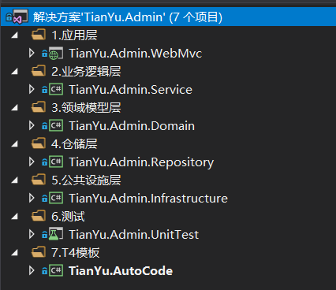

# TianYu.Admin V1.0

### 项目介绍
天宇后台管理系统 基于DDD模式框架+EF+Layui+Redis+RabbitMQ开发的后台管理系统，采用分模块的方式便于开发和维护，支持代码自动生成，目前支持的功能有：权限管理、部门管理、员工管理、角色管理、菜单管理、代码生成等，为快速开发后台系统而生的脚手架！
    
### 技术选型
* 前端技术：MVC+Layui+Jquery
* 后端技术：EF+Redis+RabbitMQ
    
### 项目结构

### 功能列表
* 员工管理：管理后台系统的用户，可进行增删改查等操作。
* 角色管理：分配权限的最小单元，通过角色给用户分配权限。
* 菜单管理：用于配置系统菜单，支持无限级菜单，可进行增删改查等操作。
* 部门管理：支持多层级部门的设置，可进行增删改查等操作。
* 代码生成：可以帮助开发者快速开发项目，减少不必要的重复操作，花更多精力注重业务实现。 

### 更新记录
* 2019-09-14 发布V1.0版本
