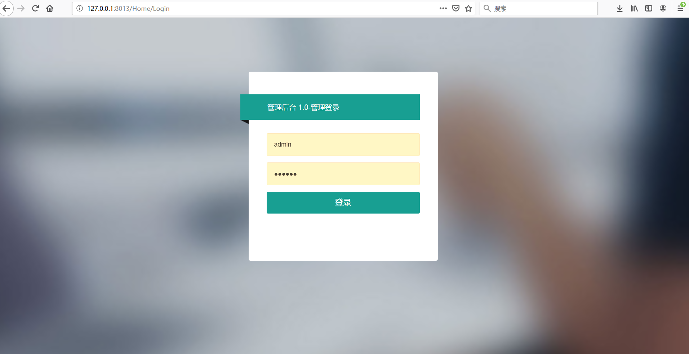

# TianYu.Admin V1.0

#### 项目介绍
&nbsp;&nbsp;&nbsp;&nbsp;&nbsp;&nbsp;&nbsp;&nbsp;天宇后台管理系统 基于DDD模式框架+EF+Layui+Redis+RabbitMQ开发的后台管理系统，采用分模块的方式便于开发和维护，支持代码自动生成，目前支持的功能有：部门管理、员工管理、角色管理、菜单管理、权限设置、字典管理、代码生成等，为快速开发后台系统而生的基础框架！
    
#### 采用技术
* 客户端技术：
	* Layui
	* Jquery
* 服务端技术：
	* ASP.NET MVC 5、Web API 2、C# 7.0
	* DDD领域驱动设计 （Entities、Repositories、Domain Services、Application Services、DTOs等）
	* Castle windsor （依赖注入容器）
	* Entity Framework 6 
	* Log4Net \ Exceptionless（日志记录）
	* AutoMapper（实现Dto类与实体类的双向自动转换）
	* Redis \ RabbitMQ \ Exceptionless 中间件 	
* 框架已实现了以下特性   
	* 统一的异常处理（应用层几乎不需要处理自己写异常处理代码） 
	* 日志记录（自动记录程序异常）
	* 模块化开发（每个模块有独立的EF DbContext，可单独指定数据库）
	* Repository仓储模式（已实现了Entity Framework）
	* Unit Of Work工作单元模式（为应用层和仓储层的方法自动实现数据库事务）
	* 已集成分布式数据缓存组件Redis  
	* 已集成消息队列组件RabbitMQ  
	* 已集成分布式日志收集系统Exceptionless 	
    
#### 项目结构

#### 功能列表
* 员工管理：管理后台系统的用户，可进行增删改查等操作。
* 角色管理：分配权限的最小单元，通过角色给用户分配权限。
* 菜单管理：用于配置系统菜单，支持无限级菜单，可进行增删改查等操作。
* 部门管理：支持多层级部门的设置，可进行增删改查等操作。
* 字典管理：用于需要配置的数据进行统一管理，如：性别男、女等。
* 代码生成：可以帮助开发人员快速的开发项目，减少不必要的重复操作，把精力放在业务实现上。 

#### 使用教程
* 环境及中间件要求
    * IDE VS2017
    * .NET Framework 4.6.1
    * Redis 3.0+
    * RabbitMQ （根据项目情况，如不需要可以不使用）
    * Exceptionless（日志记录，如果不需要则使用本地文本记录）
    * MSSql 2012
* 运行项目
    * 新建一个数据库TianYu_DB (库名自己取)
    * 执行TianYu_DB.sql(文件在解决方案文件同一目录)文件中的脚本
    * 登录账号：admin 密码：123456
* 模板生成
    * 如果未安装T4模板则需要安装下这个插件“T4 Toolbox for Visual Studio 2017”
    * 模板使用方法自行百度吧
    
#### 更新记录
* 2019-09-21 更新 
1.新增字典管理功能
2.优化页面面包屑功能
3.修改一些已知bug
* 2019-09-14 发布V1.0版本

#### 效果预览

